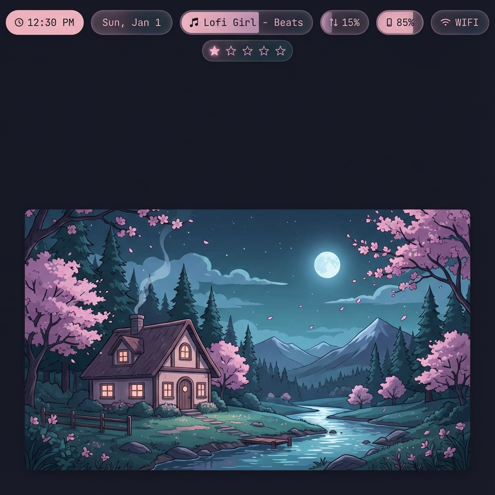
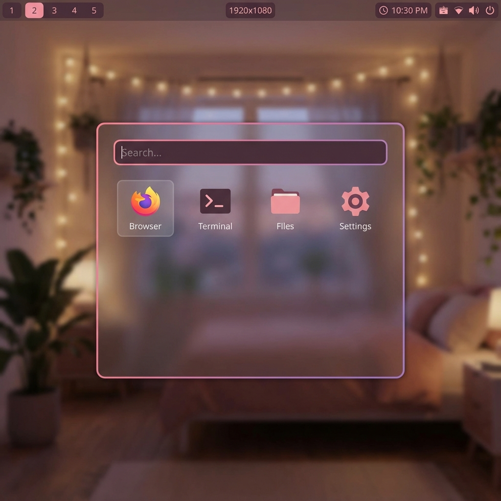

<div align="center">


# ✨ Stellar Dots ✨

**Automatic Dotfiles Installer for Hyprland**

*Inspired by the cozy aesthetics of hyprstellar*

[](https://opensource.org/licenses/MIT)
[](https://hyprland.org/)
[](https://archlinux.org/)
[](https://github.com/NoctuaCoder/stellar-dots/stargazers)

<p align="center">
  
  
  
</p>

**Languages:** [🇺🇸 English](#) • [🇧🇷 Português](README.pt-BR.md) • [🇪🇸 Español](#) • [🇫🇷 Français](#)

[Installation](#-installation) • [Features](#-features) • [How to Use](#-how-to-use-after-install) • [Themes](#-themes) • [Documentation](#-documentation) • [Screenshots](#-screenshots) • [Contributing](#-contributing) • [Roadmap](#-roadmap)

</div>

---

## 🚀 Highlights

<div align="center">

### 💎 10 Glassmorphism Menu Styles
The **largest collection** of glassmorphism menus for Hyprland!  
Inspired by: YouTube, Spotify, iOS, macOS, Smart Home, and Widget Centers.

**Styles:** Sidebar • Full • Ultimate • YouTube • Dock • Control • Cards • Dashboard • Spotify • **Widgets (NEW!)**

### 🎨 8 Beautiful Themes
Rosé Pine • Catppuccin • Nord • Stellar • Tokyo Night • Dracula • Gruvbox • Everforest

### 🎮 Gaming Ready
Automatic GPU detection (NVIDIA/AMD/Intel), drivers, and gaming tools pre-configured.

### 🛡️ Security First
Verification script, security documentation, automatic backups, and transparent installation.

### 📦 30+ Utility Scripts
Power menu, clipboard, network, bluetooth, pomodoro, backups, theme switcher, and much more!

### 🌍 International
English, Portuguese, Spanish (coming soon), French (coming soon)

</div>

---

## 🌟 Features

### Core
- ⚡ **One-Command Installation** - Single command for complete setup
- 💎 **10 Glassmorphism Menus** - Largest collection for Hyprland (Sidebar, Full, Ultimate, YouTube, Dock, Control, Cards, Dashboard, Spotify, Widgets)
- 🎨 **8 Beautiful Themes** - Rosé Pine, Catppuccin, Nord, Stellar, Tokyo Night, Dracula, Gruvbox, Everforest
- 📊 **Bar Choice** - Waybar (Simple) or Illogical-Impulse (Advanced with AI)
- 🔒 **Automatic Backup** - Your old configs stay safe
- 🚀 **Multi-Distro** - Support for Arch, Fedora, Debian/Ubuntu
- 🎯 **Interactive TUI** - Beautiful terminal interface
- 📝 **Complete Documentation** - Everything documented!
- 🛡️ **Security First** - Verification script + security docs

### Utilities
- 🔌 **Power Menu** - Shutdown, restart, lock, suspend
- 📋 **Clipboard Manager** - Clipboard history with search
- 📡 **Network Manager** - Manage WiFi easily
- 🔵 **Bluetooth Manager** - Pair and connect devices
- 🔊 **Audio Switcher** - Switch audio devices
- 😊 **Emoji Picker** - Emoji selector with search

### Gaming
- 🎮 **Gaming Support** - Automatic GPU detection and driver/tool installation
- ⚡ **Performance Profiles** - Performance, Balanced, Power Save modes
- 🎯 **Game Launcher** - Unified launcher for Steam, Lutris, Heroic

### Productivity
- 🍅 **Pomodoro Timer** - Productivity timer with notifications
- 🗂️ **Workspace Manager** - Manage workspaces easily

### System
- 📦 **Update Manager** - Update system, Flatpak, dotfiles
- 💾 **Backup Manager** - Create, restore and manage backups

### Visual
- 🔄 **Theme Switcher** - Switch themes in real-time
- 📸 **Utility Scripts** - Screenshot, wallpaper, screen recording
- 💎 **Glassmorphism menus** - 10 different launcher styles

### 💎 Glassmorphism Menu Styles

**10 unique styles inspired by modern UIs:**

| Style | Type | Inspiration | Best For |
|-------|------|-------------|----------|
| **Sidebar** | Vertical | Classic | Daily use |
| **Full** | Center | Rofi Enhanced | Search |
| **Ultimate** | Vertical | YouTube | Minimalism |
| **YouTube** | Center | YouTube UI | Premium look |
| **Dock** | Horizontal | macOS | Quick access |
| **Control** | Widgets | iOS/Android | Control center |
| **Cards** | Widgets | Smart Home | Room control |
| **Dashboard** | Complex | Smart Home Pro | Full dashboard |
| **Spotify** | Complex | Spotify | Music/Media |
| **Widgets** | 3-Column | Widget Center | **Full control panel** ⭐ |

**Launch:** `app-menu.sh [style]` or use keyboard shortcuts  
**Docs:** [Glassmorphism Menu Guide](docs/GLASSMORPHISM_MENU.md)
- 🌊 **Smooth Animations** - Modern transitions and effects
- 💎 **Glassmorphism** - Blur and transparency everywhere
- ✨ **Glassmorphism Menus** - Modern launchers with glass effect (sidebar + full menu)

## 🎨 Themes

### Rosé Pine (Default)
Soft and cozy theme with pink, purple and blue tones. Inspired by hyprstellar.

### Catppuccin Mocha
Modern pastel palette with coffee, chocolate and vibrant colors.

### Nord
Minimalist arctic theme with icy blues and elegant grays.

### Stellar (Official Theme)
Exclusive theme with cozy palette and premium design, matching the Stellar Dots aesthetic.

## 🎨 Theme Gallery

````carousel

*Rosé Pine - Cozy and elegant with soft pink and purple tones*
<!-- slide -->

*Catppuccin Mocha - Modern pastel palette with coffee and chocolate vibes*
<!-- slide -->

*Nord - Minimalist arctic theme with icy blues*
<!-- slide -->

*Stellar - Premium theme with cosmic gradients*
<!-- slide -->

*Tokyo Night - Cyberpunk aesthetic with vibrant neon colors*
````

> 💡 **More themes available:** Dracula, Gruvbox, and Everforest (screenshots coming soon!)

## 📊 Bar Options

### Waybar (Recommended)
Minimalist and stable top bar with essential modules. Lightweight, fast and easy to customize.

### illogical-impulse (Advanced)
Complete widget system with advanced features:
- 🔍 **Overview** - Live previews of open apps
- 🤖 **Integrated AI** - Gemini API and Ollama
- 🎨 **Auto-generated Colors** - Material Design based on wallpaper
- 🎯 **Advanced Widgets** - Customizable and interactive

> **Note:** illogical-impulse requires more dependencies and is installed via official script from [end-4/dots-hyprland](https://github.com/end-4/dots-hyprland)

## 🎮 Gaming Support

Stellar Dots includes complete gaming setup with:

### Automatic GPU Detection
- ✅ **NVIDIA** - Proprietary drivers + Vulkan
- ✅ **AMD** - Mesa + AMDVLK + Vulkan
- ✅ **Intel** - Mesa + Vulkan
- ✅ **Hybrid Systems** - Support for laptops with dedicated + integrated GPU

### Installed Tools
- 🎮 **Steam** - Gaming platform
- 🎯 **Lutris** - Game manager
- 🍷 **Wine/Proton** - Windows games compatibility
- ⚡ **GameMode** - Performance optimizations
- 📊 **MangoHud** - FPS overlay and monitoring
- 🎨 **GOverlay** - GUI for MangoHud

### Hyprland Optimizations
- Disables animations in games for better performance
- Specific window rules for popular games
- VRR (Variable Refresh Rate) support
- Optimized fullscreen settings

## 📦 What's Included

- **Hyprland** - Wayland compositor with amazing animations
- **Waybar** - Customized top bar with useful modules
- **Kitty** - Fast terminal with blur and transparency
- **Rofi** - Modern app launcher + glassmorphism menus
- **Hyprlock** - Lock screen with blur and effects
- **Hypridle** - Idle and suspend management
- **Starship** - Beautiful and informative prompt
- **Scripts** - 20+ utility scripts (wallpaper, screenshot, theme switcher, gaming, etc)

## 🚀 Installation

### Quick Installation

```bash
git clone https://github.com/NoctuaCoder/stellar-dots.git
cd stellar-dots
./install.sh
```

### Manual Installation

1. **Clone the repository:**
   ```bash
   git clone https://github.com/NoctuaCoder/stellar-dots.git
   cd stellar-dots
   ```

2. **Run the installer:**
   ```bash
   chmod +x install.sh
   ./install.sh
   ```

3. **Follow the on-screen instructions:**
   - Choose whether to install dependencies
   - Select the bar (Waybar or illogical-impulse)
   - Select your favorite theme
   - Wait for installation

4. **Logout and select Hyprland in your display manager**

## ⌨️ Main Shortcuts

| Shortcut | Action |
|----------|--------|
| `Super + Return` | Open terminal |
| `Super + Q` | Close window |
| `Super + D` | App launcher |
| `Super + Space` | Glassmorphism menu (full) |
| `Super + A` | Glassmorphism menu (sidebar) |
| `Super + W` | Change wallpaper |
| `Super + T` | Change theme |
| `Super + L` | Lock screen |
| `Super + Print` | Area screenshot |
| `Print` | Full screenshot |
| `Super + R` | Screen recording |
| `Super + 1-9` | Switch workspace |

[View all shortcuts](docs/HOTKEYS.md)

## 🎯 How to Use After Install

### First Steps

After logging into Hyprland:

1. **Test the basics**
   - Press `Super + Return` to open terminal
   - Press `Super + Space` for glassmorphism menu
   - Press `Super + W` to change wallpaper

2. **Customize your setup**
   ```bash
   # Change theme
   Super + T  # or run: theme-switcher.sh
   
   # Change wallpaper
   Super + W  # or run: wallpaper-changer.sh
   ```

3. **Explore utilities**
   - `Super + C` - Clipboard history
   - `Super + N` - Network manager
   - `Super + B` - Bluetooth manager
   - `Super + Period` - Emoji picker

### Daily Usage

**Window Management**
- `Super + Q` - Close window
- `Super + V` - Toggle floating
- `Super + F` - Fullscreen
- `Super + 1-9` - Switch workspace

**Screenshots**
- `Print` - Full screenshot
- `Super + Print` - Area selection
- `Super + Shift + Print` - Window screenshot

**Screen Recording**
- `Super + R` - Start/stop recording

### Customization

**Change Theme**
```bash
theme-switcher.sh
# Choose from: Rosé Pine, Catppuccin, Nord, Stellar
```

**Change Wallpaper**
```bash
wallpaper-changer.sh          # Interactive selector
wallpaper-changer.sh --random # Random wallpaper
```

**Edit Configs**
```bash
# Hyprland
nano ~/.config/hypr/hyprland.conf

# Waybar
nano ~/.config/waybar/config.jsonc
nano ~/.config/waybar/style.css

# Rofi
nano ~/.config/rofi/glassmorphism-full.rasi
```

### Utilities

**Power Menu**
```bash
power-menu.sh
# Options: Shutdown, Restart, Lock, Suspend, Logout
```

**Performance Profiles** (if gaming setup installed)
```bash
performance-profile.sh
# Modes: Performance, Balanced, Power Save
```

**Pomodoro Timer**
```bash
pomodoro.sh
# 25min work + 5min break cycles
```

**Backup Manager**
```bash
backup-manager.sh
# Create, restore, and manage config backups
```

### Troubleshooting

If something doesn't work:

1. **Check installation**
   ```bash
   ~/stellar-dots/scripts/verify-installation.sh
   ```

2. **Read troubleshooting guide**
   ```bash
   cat ~/stellar-dots/docs/TROUBLESHOOTING.md
   ```

3. **Check logs**
   ```bash
   cat /tmp/hypr/*/hyprland.log
   ```


## 📖 Documentation

- [Complete Installation Guide](docs/INSTALACAO.md)
- [Shortcuts Reference](docs/HOTKEYS.md)
- [Customization Guide](docs/CUSTOMIZACAO.md)
- [Glassmorphism Menu](docs/GLASSMORPHISM_MENU.md)
- [Troubleshooting](docs/TROUBLESHOOTING.md) ⭐ **New!**

## 🖼️ Screenshots

````carousel

*Clean desktop with Rosé Pine theme - Cozy and elegant aesthetic*
<!-- slide -->

*Full glassmorphism menu with blur effect and pink/purple gradients*
<!-- slide -->

*Catppuccin Mocha - Modern pastel palette*
<!-- slide -->

*Nord - Minimalist arctic theme with icy blues*
<!-- slide -->

*Stellar - Premium theme with cosmic gradients*
<!-- slide -->

*Tokyo Night - Cyberpunk aesthetic with vibrant neon colors*
````

### ✨ Visual Highlights
- 💎 Glassmorphism menu with glass effect and gradients
- 🌊 Smooth animations and modern transitions
- 💫 Blur and transparency throughout the system
- 🎨 8 beautiful themes to choose from
- ⭐ Star-shaped workspace indicators
- 🖥️ CPU and Memory monitoring in Waybar
- 🎯 Hover effects with elevation and glow

> 📸 More screenshots available in [`.github/screenshots/`](.github/screenshots/)

## 🛠️ Dependencies

### Essential
- Hyprland
- Waybar
- Kitty
- Rofi (Wayland)
- Dunst
- SWWW
- Hyprlock
- Hypridle

### Utilities
- grim & slurp (screenshots)
- wl-clipboard
- brightnessctl
- playerctl
- pavucontrol

### Fonts
- JetBrainsMono Nerd Font
- Noto Emoji

### Optional
- Pywal16 (dynamic colorschemes)
- wf-recorder (screen recording)

## 🤝 Contributing

Contributions are welcome! We'd love your help making Stellar Dots even better.

### How to Contribute

1. **Report Bugs**
   - Open an [issue](https://github.com/NoctuaCoder/stellar-dots/issues)
   - Include: distro, GPU, error logs
   - Steps to reproduce

2. **Suggest Features**
   - Open an [issue](https://github.com/NoctuaCoder/stellar-dots/issues)
   - Describe the feature
   - Explain why it would be useful

3. **Submit Pull Requests**
   ```bash
   # Fork the repo
   git clone https://github.com/YOUR-USERNAME/stellar-dots.git
   cd stellar-dots
   
   # Create a branch
   git checkout -b feature/amazing-feature
   
   # Make your changes
   # ...
   
   # Commit
   git commit -m "✨ Add amazing feature"
   
   # Push
   git push origin feature/amazing-feature
   
   # Open a Pull Request
   ```

4. **Share Custom Themes**
   - Create your theme in `themes/community/`
   - Follow the template in `themes/community/README.md`
   - Submit a PR!

5. **Improve Documentation**
   - Fix typos
   - Add examples
   - Translate to other languages
   - Write tutorials

### What We Need Help With

- 🎨 **New Themes** - Create beautiful color schemes
- 📝 **Documentation** - Improve guides and translations
- 🐛 **Bug Fixes** - Fix issues and improve stability
- ✨ **Features** - Implement new utilities and scripts
- 🧪 **Testing** - Test on different distros and hardware
- 📸 **Screenshots** - Capture beautiful setups
- 🎬 **Videos** - Create tutorials and demos

### Community Guidelines

- Be respectful and inclusive
- Help others in issues
- Test your changes before submitting
- Follow existing code style
- Document your changes

## 🗺️ Roadmap

### ✅ Completed (v1.0)
- [x] Glassmorphism menus (sidebar + full)
- [x] Waybar with modern features
- [x] 20+ utility scripts
- [x] Gaming support with GPU detection
- [x] 4 beautiful themes
- [x] Multi-distro support (Arch, Fedora, Debian)
- [x] Comprehensive documentation
- [x] Troubleshooting guide
- [x] Security documentation
- [x] Internationalization (English + Portuguese)

### 🚧 In Progress (v1.1)
- [ ] Screenshots and GIFs
- [ ] Video tour/demo
- [ ] Dry-run mode for installer
- [ ] Automated tests (CI/CD)

### 📋 Planned (v1.2)
- [ ] More themes (Tokyo Night, Dracula, Gruvbox, Everforest)
- [ ] Community theme system
- [ ] Modular installer (choose components)
- [ ] Better multi-distro support
- [ ] Spanish and French translations

### 🔮 Future Ideas (v2.0+)
- [ ] Web-based configuration tool
- [ ] Cloud backup integration
- [ ] Plugin system
- [ ] AI theme generator
- [ ] Mobile app for remote control
- [ ] Performance analytics dashboard

### 🎯 Goals

- ⭐ **100+ GitHub Stars** - Help us reach this milestone!
- 🍴 **50+ Forks** - Share and customize
- 👥 **Active Community** - Contributors and users
- 🌍 **Multi-language** - 5+ languages supported
- 📦 **Package Managers** - AUR, Nix, Flatpak support

**Want to help?** Pick an item from the roadmap and open an issue or PR!

## 📜 License

This project is under the MIT license. See [LICENSE](LICENSE) for more details.

## 💖 Credits

- Inspired by [hyprstellar](https://github.com/xeji01/hyprstellar)
- [illogical-impulse](https://github.com/end-4/dots-hyprland) by end-4 (advanced bar option)
- [Rosé Pine](https://rosepinetheme.com/) theme
- [Catppuccin](https://github.com/catppuccin/catppuccin) theme
- [Nord](https://www.nordtheme.com/) theme
- [Hyprland](https://hyprland.org/) compositor

## ⭐ Support

If you liked this project, leave a ⭐ on the repository!

**Found a bug?** [Open an issue](https://github.com/NoctuaCoder/stellar-dots/issues)  
**Have a question?** [Start a discussion](https://github.com/NoctuaCoder/stellar-dots/discussions)  
**Want to contribute?** See [Contributing](#-contributing) section above!

---

<div align="center">

**Made with 💜 and lots of ☕**

**Star this repo if you find it useful!** ⭐

[](https://github.com/NoctuaCoder/stellar-dots/stargazers)
[](https://github.com/NoctuaCoder/stellar-dots/network/members)

</div>
