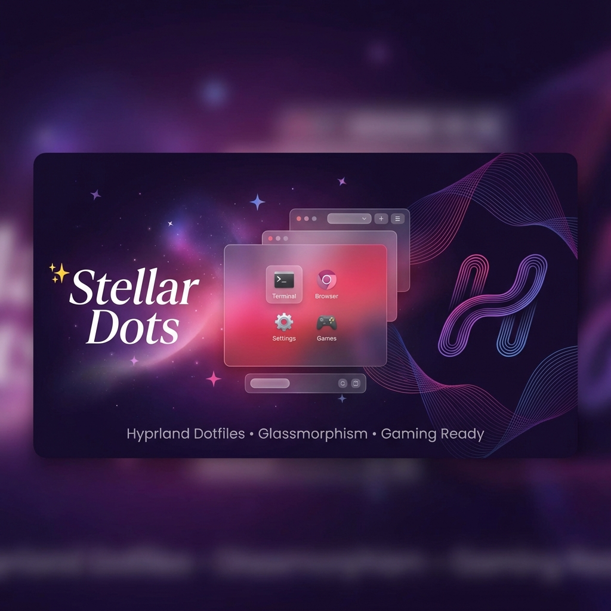

<div align="center">



# ✨ Stellar Dots ✨

**Instalador Automático de Dotfiles para Hyprland**

*Inspirado na estética cozy do hyprstellar*

[](https://opensource.org/licenses/MIT)
[](https://hyprland.org/)
[](https://archlinux.org/)
[](https://github.com/alanascanferla/stellar-dots/stargazers)

<p align="center">
  
  
  
  
</p>

[Instalação](#-instalação) • [Features](#-features) • [Temas](#-temas) • [Documentação](#-documentação) • [Screenshots](#-screenshots)

</div>

---

## 🚀 Destaques

<div align="center">

### ✨ Novo: Menu Glassmorphism
Launchers modernos com efeito de vidro, gradientes rosa/roxo/vermelho e blur intenso.  
Dois estilos disponíveis: **Sidebar compacto** e **Full menu** com busca.

### 🎨 Tema Stellar
Tema exclusivo com paleta cozy e design premium.

### 🎮 Gaming Ready
Detecção automática de GPU, drivers e ferramentas de gaming.

### 📦 20+ Scripts Utilitários
Power menu, clipboard, network, bluetooth, pomodoro, backups e muito mais!

</div>

---


## 🌟 Features

### Core
- ⚡ **Instalação One-Command** - Um único comando para setup completo
- 🎨 **Temas Lindos** - Rosé Pine, Catppuccin Mocha, Nord e **Stellar (Novo!)**
- 📊 **Escolha de Barra** - Waybar (Simples) ou Illogical-Impulse (Avançado com IA)
- 🔒 **Backup Automático** - Seus configs antigos ficam seguros
- 🚀 **Multi-Distro** - Suporte para Arch, Fedora, Debian/Ubuntu
- 🎯 **TUI Interativa** - Interface linda no terminal
- 📝 **Documentação PT-BR** - Tudo em português!

### Utilities
- 🔌 **Power Menu** - Desligar, reiniciar, bloquear, suspender
- 📋 **Clipboard Manager** - Histórico de clipboard com busca
- 📡 **Network Manager** - Gerenciar WiFi facilmente
- 🔵 **Bluetooth Manager** - Parear e conectar dispositivos
- 🔊 **Audio Switcher** - Trocar dispositivos de áudio
- 😊 **Emoji Picker** - Seletor de emojis com busca

### Gaming
- 🎮 **Suporte a Gaming** - Detecção automática de GPU e instalação de drivers/ferramentas
- ⚡ **Performance Profiles** - Modos Performance, Balanced, Power Save
- 🎯 **Game Launcher** - Launcher unificado para Steam, Lutris, Heroic

### Productivity
- 🍅 **Pomodoro Timer** - Timer de produtividade com notificações
- 🗂️ **Workspace Manager** - Gerenciar workspaces facilmente

### System
- 📦 **Update Manager** - Atualizar sistema, Flatpak, dotfiles
- 💾 **Backup Manager** - Criar, restaurar e gerenciar backups

### Visual
- 🔄 **Theme Switcher** - Troque temas em tempo real
- 📸 **Scripts Utilitários** - Screenshot, wallpaper, gravação de tela
- 🌊 **Animações Suaves** - Transições e efeitos modernos
- 💎 **Glassmorphism** - Blur e transparência em tudo
- ✨ **Menu Glassmorphism** - Launchers modernos com efeito de vidro (sidebar + full menu)


## 🎨 Temas

### Rosé Pine (Padrão)
Tema suave e aconchegante com tons de rosa, roxo e azul. Inspirado no hyprstellar.

### Catppuccin Mocha
Paleta pastel moderna com tons de café, chocolate e cores vibrantes.

### Nord
Tema ártico minimalista com azuis gelados e cinzas elegantes.

## 📊 Opções de Barra

### Waybar (Recomendado)
Barra superior minimalista e estável com módulos essenciais. Leve, rápido e fácil de customizar.

### illogical-impulse (Avançado)
Sistema completo de widgets com features avançadas:
- 🔍 **Overview** - Live previews de apps abertos
- 🤖 **IA Integrada** - Gemini API e Ollama
- 🎨 **Cores Auto-geradas** - Material Design baseado no wallpaper
- 🎯 **Widgets Avançados** - Customizáveis e interativos

> **Nota:** illogical-impulse requer mais dependências e é instalado via script oficial do [end-4/dots-hyprland](https://github.com/end-4/dots-hyprland)

## 🎮 Suporte a Gaming

O Stellar Dots inclui setup completo para gaming com:

### Detecção Automática de GPU
- ✅ **NVIDIA** - Drivers proprietários + Vulkan
- ✅ **AMD** - Mesa + AMDVLK + Vulkan
- ✅ **Intel** - Mesa + Vulkan
- ✅ **Sistemas Híbridos** - Suporte a laptops com GPU dedicada + integrada

### Ferramentas Instaladas
- 🎮 **Steam** - Plataforma de jogos
- 🎯 **Lutris** - Gerenciador de jogos
- 🍷 **Wine/Proton** - Compatibilidade com jogos Windows
- ⚡ **GameMode** - Otimizações de performance
- 📊 **MangoHud** - Overlay de FPS e monitoramento
- 🎨 **GOverlay** - Interface gráfica para MangoHud

### Otimizações Hyprland
- Desabilita animações em jogos para melhor performance
- Window rules específicas para jogos populares
- Suporte a VRR (Variable Refresh Rate)
- Configurações de fullscreen otimizadas

## 📦 O Que Está Incluído

- **Hyprland** - Compositor Wayland com animações incríveis
- **Waybar** - Barra superior customizada com módulos úteis
- **Kitty** - Terminal rápido com blur e transparência
- **Rofi** - Launcher de apps com design moderno + menus glassmorphism
- **Hyprlock** - Lock screen com blur e efeitos
- **Hypridle** - Gerenciamento de idle e suspend
- **Starship** - Prompt bonito e informativo
- **Scripts** - 20+ scripts utilitários (wallpaper, screenshot, theme switcher, gaming, etc)

## 🚀 Instalação

### Instalação Rápida

```bash
git clone https://github.com/alanascanferla/stellar-dots.git
cd stellar-dots
./install.sh
```

### Instalação Manual

1. **Clone o repositório:**
   ```bash
   git clone https://github.com/alanascanferla/stellar-dots.git
   cd stellar-dots
   ```

2. **Execute o instalador:**
   ```bash
   chmod +x install.sh
   ./install.sh
   ```

3. **Siga as instruções na tela:**
   - Escolha se quer instalar dependências
   - Selecione a barra (Waybar ou illogical-impulse)
   - Selecione seu tema favorito
   - Aguarde a instalação

4. **Faça logout e selecione Hyprland no seu display manager**

## ⌨️ Atalhos Principais

| Atalho | Ação |
|--------|------|
| `Super + Return` | Abrir terminal |
| `Super + Q` | Fechar janela |
| `Super + D` | Launcher de apps |
| `Super + Space` | Menu glassmorphism (full) |
| `Super + A` | Menu glassmorphism (sidebar) |
| `Super + W` | Trocar wallpaper |
| `Super + T` | Trocar tema |
| `Super + L` | Lock screen |
| `Super + Print` | Screenshot de área |
| `Print` | Screenshot completo |
| `Super + R` | Gravar tela |
| `Super + 1-9` | Trocar workspace |


[Ver todos os atalhos](docs/HOTKEYS.md)

## 📖 Documentação

- [Guia de Instalação Completo](docs/INSTALACAO.md)
- [Referência de Atalhos](docs/HOTKEYS.md)
- [Guia de Customização](docs/CUSTOMIZACAO.md)
- [Menu Glassmorphism](docs/GLASSMORPHISM_MENU.md)
- [Troubleshooting](docs/TROUBLESHOOTING.md) ⭐ **Novo!**


## 🖼️ Screenshots

*Screenshots em breve!*

### ✨ Destaques Visuais
- Menu glassmorphism com efeito de vidro e gradientes
- Animações suaves e transições modernas
- Blur e transparência em todo o sistema
- Temas cozy e aconchegantes

## 🛠️ Dependências

### Essenciais
- Hyprland
- Waybar
- Kitty
- Rofi (Wayland)
- Dunst
- SWWW
- Hyprlock
- Hypridle

### Utilitários
- grim & slurp (screenshots)
- wl-clipboard
- brightnessctl
- playerctl
- pavucontrol

### Fontes
- JetBrainsMono Nerd Font
- Noto Emoji

### Opcional
- Pywal16 (colorschemes dinâmicos)
- wf-recorder (gravação de tela)

## 🤝 Contribuindo

Contribuições são bem-vindas! Sinta-se livre para:
- Reportar bugs
- Sugerir novas features
- Enviar pull requests
- Compartilhar seus temas customizados

## 📜 Licença

Este projeto está sob a licença MIT. Veja [LICENSE](LICENSE) para mais detalhes.

## 💖 Créditos

- Inspirado por [hyprstellar](https://github.com/xeji01/hyprstellar)
- [illogical-impulse](https://github.com/end-4/dots-hyprland) por end-4 (opção de barra avançada)
- [Rosé Pine](https://rosepinetheme.com/) theme
- [Catppuccin](https://github.com/catppuccin/catppuccin) theme
- [Nord](https://www.nordtheme.com/) theme
- [Hyprland](https://hyprland.org/) compositor

## ⭐ Suporte

Se você gostou deste projeto, deixe uma ⭐ no repositório!

---

<div align="center">

**Feito com 💜 e muita ☕**

</div>
